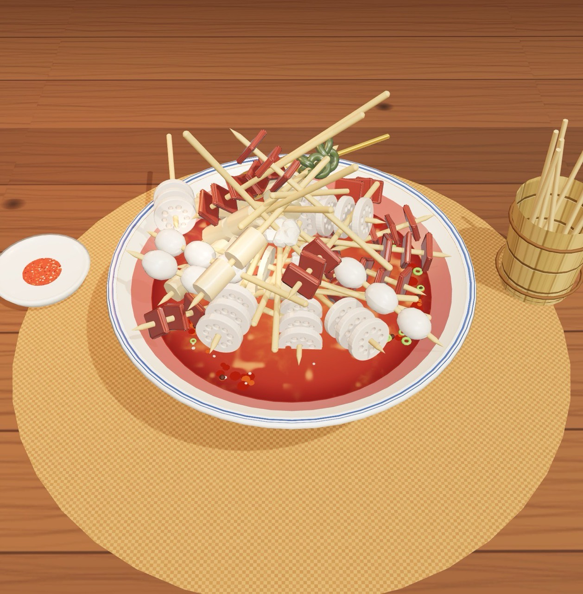

# 🍢 钵钵鸡 · 签签拔起来

> 硅谷冷串串 · 巴适得板 ——— 一款灵感来自「抓大鹅」的 3D 物理拔签小游戏
>
> **作者：圣何塞椰子鸡 · 谨以此游戏致敬我最好的成都友友们** ❤️

一钵滚烫红汤，几十根竹签层层叠叠压在一起。**上面压着别根签的签是拔不动的** —— 看清层叠关系、找到"自由"的签，在时间耗尽前把整钵签签全部安排！拔出的签当场吃掉，光签落进签筒，数签结账。



## 🎮 玩法

- 🍢 **点击没被压住的签**把它拔出来吃掉，光签会落进旁边的签筒计数
- ⛔ 点到**被压住的签**：扣 2 秒，压住它的"元凶"会闪红光提示
- ⚡ 手快**连击**有额外加分，连到位川妹儿开夸：巴适！安逸～雄起！
- 🌟 **金签黄金卤蛋** +8 秒 +300 分，看到先抢
- 🥢 卡住了喊**友友帮吃**：直接替你吃掉最上面 3 签（压住的也照吃）。第几碗就有几次，真死锁了免费送
- 👆 拖动空白处旋转视角、滚轮/双指缩放，看清哪根签在最上面
- 💤 6 秒没动作会提示一根能拔的签；签沉在汤底时用涟漪指位置

### 菜单

| 关卡 | 签数 | 时间 | 说明 |
| --- | --- | --- | --- |
| 🥣 小碗 | 16 串 | 90s | 先垫个肚子 |
| 🍜 中碗 | 26 串 | 110s | 含 1 根金签 |
| 🍲 大盆 | 38 串 | 140s | 含 2 根金签 |
| ♾️ 流水席 | 无尽 | 拔一签回一口气 | 每 11 签"老板加签！"，冲最高分 |

按剩余时间结星（★★★），成绩存在本地 localStorage。

## 🛠 技术实现

**零外部资源**：所有 3D 模型程序化生成、所有纹理 Canvas 绘制、所有音效 WebAudio 合成——仓库里没有一张图片、一个模型文件、一条音频（README 截图除外 😄）。

| 模块 | 方案 |
| --- | --- |
| 渲染 | [Three.js](https://threejs.org/)：ACES 色调映射、PCF 软阴影、房间环境反射 |
| 物理 | [Rapier](https://rapier.rs/)（WASM）：每根签 = 细胶囊签身 + 各食材凸体的复合刚体；碗壁/碗唇用两圈斜置凸盒拼成，避开 Trimesh 碰撞的坑 |
| **压签判定** | 遍历该签所有碰撞体的**接触对**，取接触流形法线：法线竖直分量 > 0.42 即"对方压在我上面"。拔签 = 移除刚体，上层实时塌落重排 |
| 食材建模 | 藕片（带孔 ExtrudeGeometry）、海带结（环面纽结）、鹌鹑蛋、郡肝（噪声凸包）、土豆片、豆皮卷、花菜、牛肉片 + 金签卤蛋；红油挂汁 = clearcoat 清漆材质 |
| 红汤 | 自定义 shader：fbm 油花回旋 + 油光闪点 + 事件驱动涟漪环；辣椒碎/花椒/葱花/芝麻是带环流场与推开力的实例化粒子 |
| 特效 | 红油飞溅粒子池、三段式拔签动画（拔出→逐口吃→光签入筒）、蒸汽 sprite、相机震动、HTML 飘字 |
| 音效 | 全部 WebAudio 现场合成：拔签"啵"、咀嚼、光签入筒、连击五声音阶、被压闷响、摇碗晃汤 |

### 防挫败设计

被压时闪红光标出元凶、静默提示可拔的签、死锁检测免费送"帮吃"、飞出碗外的签自动捞回、点空汤面也能拨出涟漪解压。

## 🧑‍💻 本地开发

```bash
npm install
npm run dev      # http://localhost:5173
npm run build    # 产物在 dist/
```

调试模式：URL 加 `?debug=1`，控制台可用 `__boboji`（`freeIds()` / `tryPick(id)` / `setTime(s)` / `startLevel(id)` 等）。

推送到 `main` 会自动构建并部署 GitHub Pages（见 `.github/workflows/deploy.yml`，需在仓库 Settings → Pages 选择 "GitHub Actions" 作为来源）。

## 🙏 参考与致谢

- 玩法灵感：微信小游戏「抓大鹅」
- 技术路线参考：[前端实现"抓大鹅"游戏（掘金）](https://juejin.cn/post/7375090667732680758)、[Yuming0929/goose-catch](https://github.com/Yuming0929/goose-catch)
- 使用 [Claude Code](https://claude.com/claude-code) 设计与实现

🌶️ 吃好喝好，签签拔完再走～
